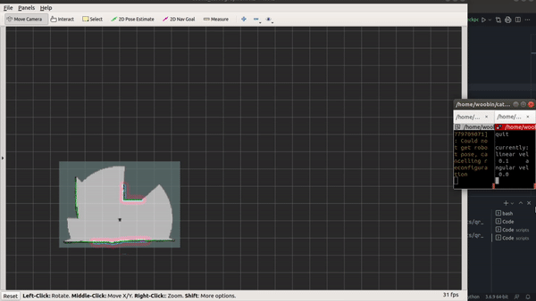
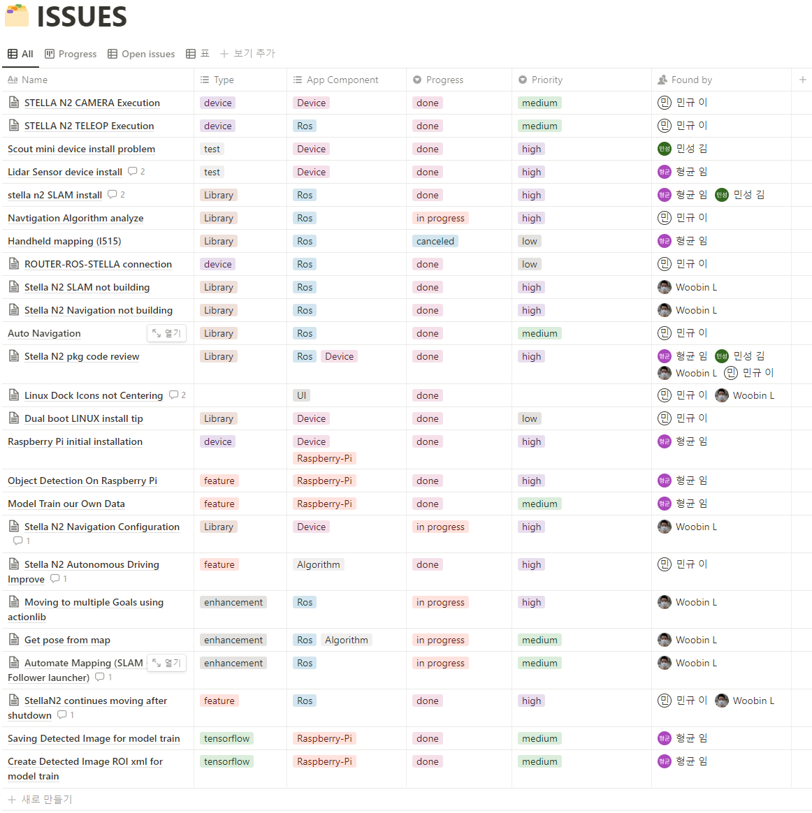
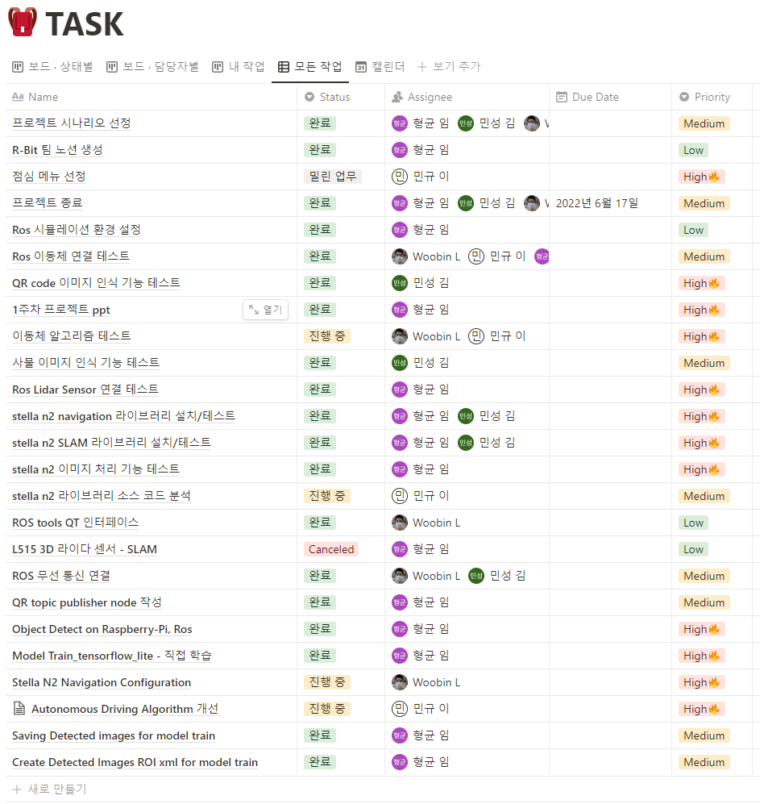
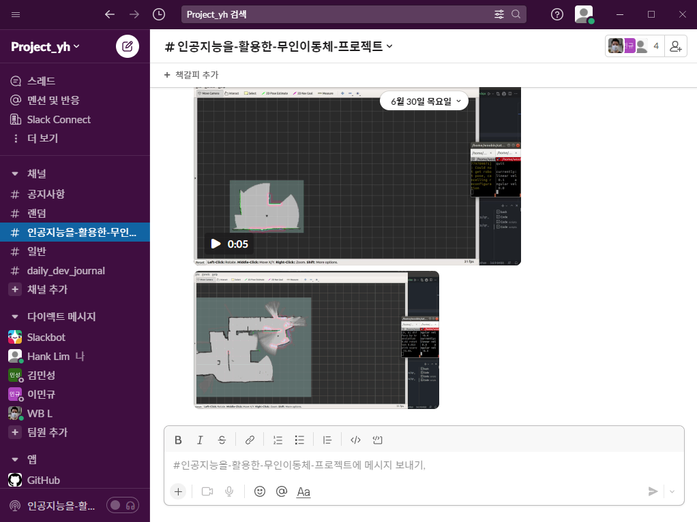

# 인공지능 기반 박물관 큐레이터 구현을 위한 기반 기술
*무인이동체를 활용한 인공지능 자율주행(K-Digital) 프로젝트 - 기능 구현을 위해 인공지능 '인지'를 공간과 객체로 분류하여 구현했습니다.*

*(gif 로딩에 다소 시간이 걸릴 수 있습니다.)*

## ABOUT

  

  SLAM & Wall-Follower

### Tech Base

#### 1. 언어
* Python - 구현
* C, C++ - 코드리뷰

#### 2. 환경
* ROS (ROS1_melodic)
* Linux (Ubuntu_18.04, Debian_buster)
* SBC, MCU (Odroid_C4, Raspberry-Pi_4 Model B)

#### 3. 프로젝트 관리 도구
* git, github
  * repository 생성
  * ~~버전관리, 협업 (미실시)~~
    * 미실시 사유 - 다른 관리도구로 대체 가능하였음
      * 하드웨어, 구동 환경 2원화
      * 버전관리 및 협업 Slack, Notion 환경에서 실시
* Notion (https://www.notion.so/HOME-b09bad420f4242c2bd7d9d953949108f)
  * Meeting Log
  * Issue 관리
  * Task 관리
* Slack
  * 커뮤니케이션
  * daily dev journal
  * data, code 공유

## Reference별 분류

* 공간 인지 및 주행 (https://github.com/ntrexlab/STELLA_REMOTE_PC_N2)
  * Cartographer (https://github.com/cartographer-project/cartographer_ros)
    * SLAM - 좌표계 시스템과 Map
      * 2D Map
        * Lidar Depth (https://github.com/EAIBOT/ydlidar)
        * IMU (https://github.com/ntrexlab/ahrs_v2_ROS1)
      * Coordination System
        * Cartesian coordinate system
        * Quaternions
    * Navigation - 주행 알고리즘과 Calibration (https://github.com/cartographer-project/cartographer)
      * Drive Algorithm
      * Sensor Calibration

* 객체 인지 (https://github.com/tensorflow/examples)
  * Tensorflow
    * Tensorflow-lite
      * Object Detect (On Android and Raspberry-Pi)
    * tflite Model-Maker (Colab)
      * https://colab.research.google.com/github/khanhlvg/tflite_raspberry_pi/blob/main/object_detection/Train_custom_model_tutorial.ipynb
    
    
    
## 세부 기능별 분류

### 1. 실내 측위를 위한 2D맵 생성
* SLAM
  * Lidar sensor
  * IMU sensor
* 좌표계
  * 위치 분석을 위한 Cartesian coordinate system과 주행 동작을 위한 Quaternions 변환

### 2. 맵 생성과 가이드를 위한 Autonomous 주행
* 'D*' 주행 알고리즘

### 3. 관리자 GUI
* PyQt 활용하여 관리자 GUI 구현
  * ROScore와 연동하여 조작 및 모니터링 구현

### 4. 맵, 기준좌표, 객체 위치 좌표 저장 + ~~저장된 데이터 로딩하여 동작 구현 (미구현)~~
  #### 구현된 기능
  * 2D맵 저장 - Map Server, Map Saver
  * 2D맵 로딩 - Navigation Parameter
  * 객체 좌표 저장

  

  GUI & Map Saving

  #### 미구현 기능
  * Auto Pose estimation
    * Navigation Pose Calibration Issue
      * *sensor-pose calibration 작동 이슈*
  #### 미구현 기능 대체 기능
  * 실시간 작동
    * 작동 종료시 맵, 좌표, 객체 위치 데이터 휘발
      * 초기화 및 2D맵 스캔 등 초기화 후 기능 동작
      * SLAM Pose Calibration은 정상적으로 작동
      * SLAM 환경의 Pose Calibration을 활용하려 시도했으나, 장애물 인지, 회피 주행, 맵 update 등과 충돌

### 5. Autonomous Mapping
* Wall-Follower
  * 벽면과 일정한 거리를 유지하며 자율 주행 (2D맵 자동 생성)

  

  Wall-Follower 주행

### 6. 객체 인식 & 인식을 위한 분류 모델 생성
* 객체 인식
  * Object Detect (On Android and Raspberry-Pi)
* 모델 생성
  * tflite Model-Maker
    * Colab Notebook (https://colab.research.google.com/github/khanhlvg/tflite_raspberry_pi/blob/main/object_detection/Train_custom_model_tutorial.ipynb)
* Auto Labeling
  * xml tree 활용하여 자체 구현
    * 객체 인식 되었을 시, 이미지와 객체 ROI 정보를 xml형식으로 자동 변환하여 timeline에 맞추어 저장
    * 추후 자체 모델 학습 시 데이터 전처리 과정에서 Labeling 소요 절감 기대
    

  

  Auto Labeling

# 프로젝트 관리
* Simulator (https://github.com/ROBOTIS-GIT/turtlebot3_simulations)
  * 코드 테스트 및 변수 관리
* Notion
* Slack - 커뮤니케이션

## Simulator (Turtlebot3_simulations)
*실제 이동체에 적용하기 전 시뮬레이션 환경에서 알고리즘 테스트 실시*

  

  Simulation (turtlesim)

## 이슈 관리 (Notion)

  

  Issue Log

* Notion
  * https://www.notion.so/924096c581d643c78881fb4c7dbbb3f5?v=d9bff0f0c53d44f2a83fa9b8618f0c5f
  

## 테스크 관리 (Notion)

  

  Task Log

* Notion
  * https://www.notion.so/574ceb7ae62143b3847b295002abf0e2?v=8f01e42b95b64fbf84bf2470895841e6

## 커뮤니케이션 관리 (Slack)
* 커뮤니케이션
* daily_dev_journal - 일일 개발 일지 관리
* data, code 공유 및 버전 관리

  

  

# 미구현 및 개선사항

## 저장된 맵 정보를 불러온 뒤 정상적으로 작동하는 기능 구현 미완성
  * 미완성 사유
    * Navigation Pose Estimation Issue
      * 2D맵 저장, 불러오기 기능 구현은 완성
      * Navigation을 위한 2D맵 불러오기 이후, 이동체 위치 calibration이 정상적으로 작동하지 않아 위치 오차가 지속적으로 누적
  * Try&Error
    * SLAM 환경에서 정상적으로 Calibration이 작동하는 점에서 착안, SLAM 환경에서의 calibration method를 Navigation 환경에 적용 시도
      * lidar depth 기반 위치 추정하는 정확한 알고리즘 분석 미흡
      * SLAM method 강제 적용시 2D맵 정보가 override되는 현상 발생
  * 향후 개선 방법
    * Navigation Pose Estimation Issue는 AMR 구현의 고질적인 이슈
    * SLAM에서 위치를 추정하기 위해 사용하는 알고리즘 대략적인 위치 추정, (Grid map 분할), 범위 내 depth 정보 비교

## Full Autonomous Drive 미완성
  * 미완성 사유
    * Wall_follower Node 기반의 완전 자동화를 구현하려고 하였으나, GUI, Remote_PC 등 분산되어 있는 처리를 통합하는 과정에서 잦은 에러 발생, 초기 계획보다 소요 시간이 길어져서 완성 시간 부족
  * How to solve
    * 이동체 초기화 위치 원점(0, 0, 0, 0)을 기반으로 4사분면으로 분할, 4분면 모두 방문한 이후 원점과 근접할 시 (tolerance 70% 이상) 원점으로 강제 이동 및 대기모드 전환 (미구현)
    * 2D맵 폐쇄성 검사(벽면으로 모든 공간이 막혀 있는지 여부 확인), 스캔 완성도 검사(벽면 외에 스캔되지 않은 영역 존재 여부 확인) 실시 후 통과할 시 원점으로 강제 이동 및 대기모드 전환 (미구현)
  * 향후 개선 방법
    * 주간 단위 프로젝트 통합을 실시하여 최종 기능 통합 시 소요시간 단축
  
  * wall-follower 완전자동화
  * 제어 완전 자동화

## 객체 인지 모델 정확도 부족
  * 부족 사유
    * 학습 데이터 부족
      * 이미지는 충분히 확보하였으나 데이터 전처리 및 라벨링 작업에 예상되는 소요 시간이 길어 부득이하게 최소한의 데이터만으로 모델 학습 실시
  * 향후 개선 방법
    * Auto labeling 기능 활용
    * 유사 프로젝트 진행시, 모델 학습을 위한 데이터에 대한 검토를 프로젝트 초반부터 실시하여 데이터 확보 및 전처리에 충분한 시간 할당

## git, github 활용 미비
  * 미흡 사유
    * 대면 커뮤니케이션
      * 대부분의 프로젝트 진행이 대면 상태에서 모여서 진행되었습니다. 별도로 github를 통해 소통할 필요성이 없었습니다.
    * 기능 구현을 위해 필요한 코드의 양이 적었음
      * 기존의 패키지, 라이브러리를 분석하고 구조를 변경하거나 파라미터를 변경하는 작업이 주요 작업이었습니다.
      * 기존 패키지의 내용은 유지한 상태에서 변경된 구조, 파라미터만을 공유하는 것으로도 충분했습니다.
    * Odroid, Raspberry-Pi, Remote_PC(Core) 코드 분산
      * 이동체 연산부, 객체 인식 연산부, Core원격PC로 코드가 분산되어 있어서 github를 통해 관리할 시 1~20분마다 매번 pull, push, merge를 해야 하는 번거로운 상황이 발생하였기 때문에 Slack을 중심으로 코드 공유 및 버전관리를 실시하였습니다.
  * 향후 개선 방법
    * 모듈, 패키지화
      * 프로젝트 repository 내부에 각 파트별, 기능별로 코드를 모듈, 패키지화하여 독립적으로 관리
    * 코드리뷰 기반 커뮤니케이션 실시
      * github 내부의 comment 기능을 활용하여 Slack, github 이원화 관리에서 github 단일 소스 기반 관리
    * 주석, 코드 리뷰 코드 중심 일원화 관리
      * 추가, 수정되는 내용이 적은 상황에서도 주석, 리뷰 중심의 변동 사항을 남기는 방식으로 관리

## References

https://github.com/ntrexlab/STELLA_REMOTE_PC_N2
  * 실습용 이동체 Stella N2 제공 모듈
    * Cartographer (SLAM, Navigation) 패키지 포함
    * Hardware (Lidar, IMU, Motordriver, Camera) 패키지 포함
    
https://github.com/ROBOTIS-GIT/turtlebot3_simulations
  * 터틀봇 시뮬레이터 패키지 - 터틀심
    * 실제 기능 적용 이전 시뮬레이션 테스트
    * Node, topic, service 구조 파악

https://github.com/tensorflow/examples
  * Tensorflow를 활용하는 다양한 기능이 포함된 패키지
    * Object Detection 모듈 사용

https://colab.research.google.com/github/khanhlvg/tflite_raspberry_pi/blob/main/object_detection/Train_custom_model_tutorial.ipynb
  * Model-Maker
    * 자체 데이터(img + xml)를 활용한 tflite 분류 모델 학습
    
https://github.com/dstjr2434/ros_git
  * 프로젝트 조원 repository
----------

*참고 Reference*

https://github.com/cartographer-project/cartographer
  * 카토그래퍼 repository
    * SLAM Calibration과 Navigation Pose Estimation 기능 분석을 위해 활용

https://github.com/cartographer-project/cartographer_ros
  * ROS 환경에서 작동하는 카토그래퍼 repository
    * ROS 환경에서 SLAM, Navigation 노드 구조 분석을 위해 활용

https://github.com/ros-perception/slam_gmapping
  * SLAM gammping 패키지
    * 맵 생성과 좌표계 시스템 분석을 위해 활용

https://github.com/ntrexlab/MW_MotorControllers_Manual
  * 모터 드라이버 (Stella_N2 의존성 패키지)
    * 주행성 개선, 위치 정확도 개선을 위해 slip현상 억제를 위해 encode 분석 목적으로 활용
    
https://github.com/EAIBOT/ydlidar
  * 라이다 센서 패키지 (Stella_N2 의존성 패키지)
    * 라이다 센서 raw data 분석을 위해 활용
      * 라이다 raw data 중에서 관심 영역의 depth를 추출하기 위해 활용
      * 라이다 raw data와 map depth 비교를 통한 위치 보정 정보 분석을 위해 활용

https://github.com/ntrexlab/ahrs_v2_ROS1
  * IMU 센서 패키지  (Stella_N2 의존성 패키지)
    * pose estimation 오차 분석을 위해 활용

https://github.com/tensorflow/tensorflow
  * Tensorflow repository
    * Tensorflow 환경설정, 구조, 예시 분석을 위해 활용
    
https://github.com/EdjeElectronics/TensorFlow-Object-Detection-on-the-Raspberry-Pi
  * TensorFlow-Object-Detection-on-the-Raspberry-Pi
    * 라즈베리파이 환경에서 원활하게 작동하는 객체 인식을 위해 참조
    * tflite로 기능 구현 이후에는 참조용으로 활용

https://teachablemachine.withgoogle.com/
  * Classification Model 학습을 Local 환경설정 없이 구현하기 위해 참조
  * tflite Model-Maker로 모델 학습 이후에는 참조용으로 활용

https://github.com/nimbekarnd/Wall-follower-in-ROS-using-Python
  * Wall-Follower opensource
    * Wall-Follower 알고리즘 개선을 위해 참조

https://github.com/ssscassio/ros-wall-follower-2-wheeled-robot
  * Wall-Follower opensource
    * Wall-Follower 알고리즘 개선을 위해 참조

